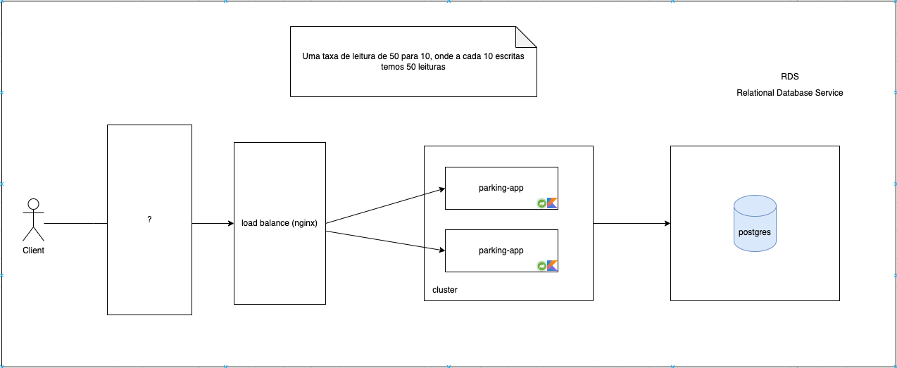
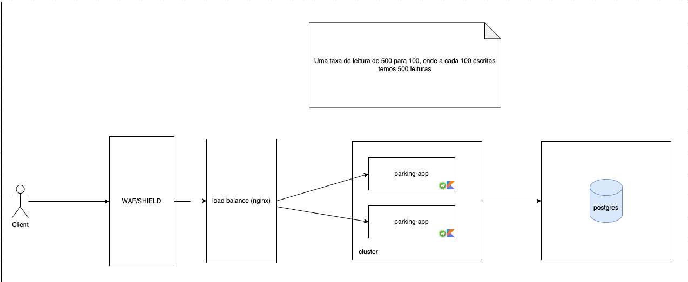
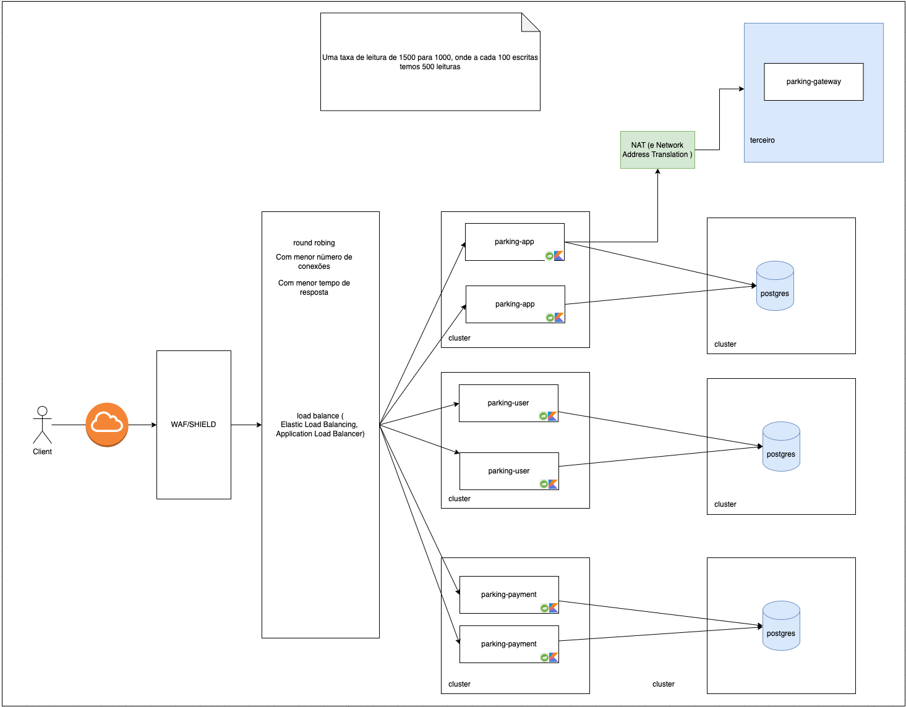

# Sistema de Parquímetro

Aluno: **Marcelo Souza Leite**  
**Prova Substituta**  
Repositório: [https://github.com/marsleite/sub-parking](https://github.com/marsleite/sub-parking)

O sistema de parquímetro é responsável por gerenciar o tempo de estacionamento de veículos, calcular valores devidos e armazenar dados para fins de fiscalização. Esta RFC detalha a arquitetura, tecnologias e funcionalidades do sistema.

## Tecnologias Utilizadas

- **Kotlin/Java 21:** Linguagem de programação e JVM.
- **Spring Boot:** Framework para construção de aplicativos Java.
- **Banco de Dados:** PostgreSQL (SQL) para armazenamento de dados.
- **Cache:** Redis (NoSQL) para caching de dados.

## Arquitetura do Sistema

O sistema será dividido em três camadas:

- **Controller:** Recebe requisições HTTP, valida parâmetros e chama métodos apropriados no serviço.
- **Service:** Contém a lógica de negócios, calcula valores e interage com o banco de dados.
- **Banco de Dados:** PostgreSQL para armazenar detalhes de estacionamento e Redis para caching.
- **Clean Arch:** Padrão de arquitetura limpa para melhor manutenção.

## Funcionalidades

### Registrar Estacionamento
- Entrada do número da placa do veículo.
- Registra a hora de entrada e a localização do veículo.
- Gera um ID de transação único para referência futura.

### Calcular Valor Devido
- Com base na hora de entrada e saída, calcula o valor devido utilizando uma taxa por hora predefinida.

### Armazenar Dados
- Armazena dados de transações no PostgreSQL para fins de fiscalização.
- Utiliza Redis como cache para evitar chamadas desnecessárias ao banco de dados.

## Endpoints da API

- **POST `/parking`:** Registra a entrada do veículo, retorna o ID da transação.
- **PUT `/parking/{id}/outline`:** Registra a saída do veículo, calcula o valor devido e retorna o valor.
- **GET `/transactions/{placa}`:** Retorna todas as transações associadas a uma placa específica.

## Considerações de Performance

- **Uso do Redis:** Utilizar Redis como cache para evitar consultas excessivas ao banco de dados.
- **TTL no Redis:** Implementar TTL (Time-To-Live) no Redis para evitar que dados desatualizados sejam utilizados.
- **Índices no Banco de Dados:** Configurar índices apropriados no banco de dados para otimizar consultas.

## Escalabilidade do Sistema

O projeto nasce como um monolito, mas conforme a demanda for crescendo, há a necessidade de torná-lo um sistema distribuído (microservices).

### Exemplo de Taxas de Leitura/Escrita

- **50:10:** Para cada 10 escritas, temos 50 leituras.

- **500:100:** Para cada 100 escritas, temos 500 leituras.

- **1500:1000:** Para cada 1000 escritas, temos 1500 leituras.

### Exemplo Prático

- **Tempo médio de processamento por requisição (T_req):** 0.5 segundos.
- **Requisições por thread por minuto (R_thread):** `60 / 0.5 = 120`
- **Número total de requisições por minuto (R_total):** `50 x 120 = 6000`

Com 50 threads, cada processando uma requisição a cada 0.5 segundos, o sistema poderia processar até 6000 requisições por minuto. Este é um exemplo que podemos tomar como base para planejamento de escalabilidade do sistema.

**Observação:** Cada microserviço pode utilizar tecnologias diferentes, o que pode impactar a performance em leitura e escrita. É importante avaliar cada especificidade.

## Considerações de Eficiência

- **Eficiência do Sistema:** Se o sistema não for 100% eficiente (por exemplo, devido à sobrecarga ou contenção de recursos), o número real de requisições pode ser menor.
- **Variação no Tempo de Processamento:** Se o tempo médio de processamento variar, o cálculo pode precisar ser ajustado com base na média ou na distribuição real dos tempos de processamento.

## Considerações Finais

### Serverless vs. Servidores Dedicados ou Contêineres

#### **Serverless**
- **Escalabilidade Automática:** Serverless escala automaticamente com base na demanda.
- **Custo Eficiente para Carga Variável:** Paga-se apenas pelo tempo de execução das funções e pelos recursos consumidos.
- **Gerenciamento Simplificado:** A infraestrutura subjacente é gerenciada pelo provedor, liberando a equipe para focar na lógica de negócio.

##### **Cálculo de Custos:**
- **Exemplo:** Cada requisição processa em 0,5 segundos com 128MB de memória.
- **Custo típico:** $0.00001667 por segundo de execução por GB de memória.
- **Custo por minuto:** `6000 x 0.5s x 128MB/1024MB x 0.00001667 ≈ $0.006`
- **Custo por hora:** Aproximadamente $0.36 por hora de execução contínua, podendo variar com a carga real.

### Conclusão

O sistema de parquímetro proposto oferece funcionalidades básicas para gerenciar estacionamentos, calcular valores e armazenar dados para fiscalização. A utilização de tecnologias como Java/Kotlin, Spring Boot, PostgreSQL e Redis proporciona uma base sólida para o desenvolvimento do projeto.

O estudo de escalabilidade permite que o sistema suporte a demanda e ofereça um serviço robusto, com estratégias de resiliência e uso de load balancer. A evolução para um sistema distribuído será necessária conforme o crescimento da demanda.
